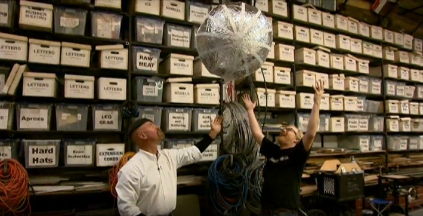
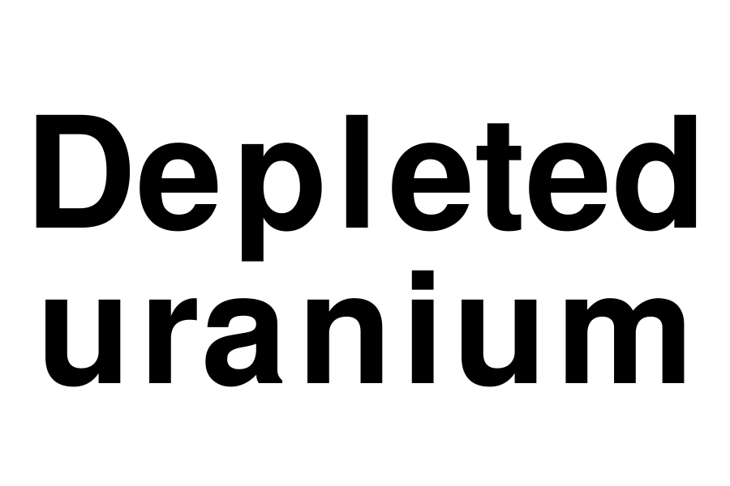

# jamie

Prints labels from the command line

Inspired by (and named after) Jamie Hyneman's meticulously labeled storage bins at M5 Industries, shown here on *MythBusters*:

 

jamie.py uses a brute-force testing of font sizes and line wraps to fit the text onto a 3 inch by 2 inch label as efficiently as possible. 

## Dependencies

Requires [Pillow](https://pillow.readthedocs.io/en/stable/):

    pip3 install Pillow

jamie.py also uses the [GNU FreeFont](https://www.gnu.org/software/freefont/) `FreeSansBold.ttf`, included in this repository for convenience.

## Printer and labels

Tested using [this iDPRT SP410 thermal label printer](https://www.amazon.com/gp/product/B08QYNKT7L), though it should work with other printers.

Tested using a roll of 3 inch by 2 inch labels, but other label sizes are possible if you edit `width` and `height` in the code.

## Usage

Running

    python3 jamie.py "Depleted uranium"

automatically prints this label:

<kbd>
    
</kbd>
